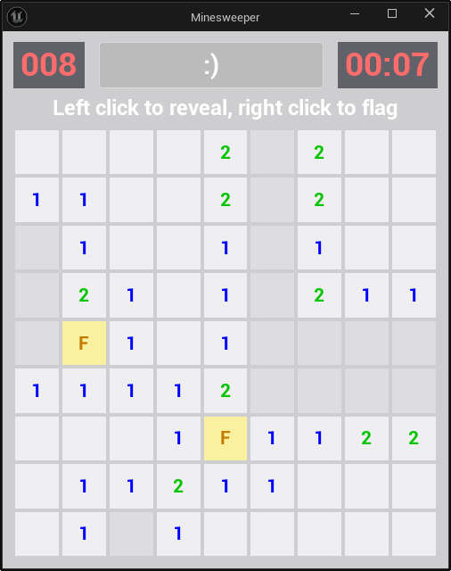
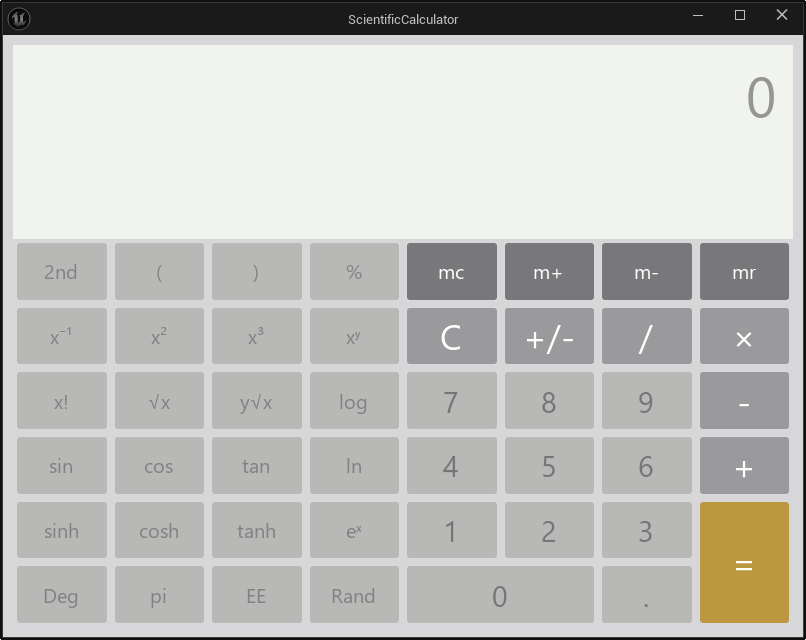

# WidgetMarkup

**English** | [简体中文](README.zh-cn.md)

Build UMG widget trees, Blueprints, and reactive UI with XML and Python in Unreal Engine.


## Quick Start

1. Enable the WidgetMarkup plugin in the Unreal Editor.
2. Prepare a `*.widgetmarkup` file in your project content source.
3. In the Editor CMD input bar, run:

```txt
WidgetMarkup.Show /Game/WidgetMarkup/Example
```

4. The preview window opens and updates when the source file changes.

## XML Syntax

### Widget Blueprint

```xml
<WidgetBlueprint Script="Samples.MyComponent">
  <WidgetTree>
    <CanvasPanel>
      <TextBlock Text="Hello" Slot.bAutoSize="True"
        Slot.LayoutData.Anchors.Minimum="0.5,0.5"
        Slot.LayoutData.Anchors.Maximum="0.5,0.5"
        Slot.LayoutData.Alignment="0.5,0.5" />
    </CanvasPanel>
  </WidgetTree>
</WidgetBlueprint>
```

- `Script` — Python component module path.
- `Super` — parent class (defaults to `UWidgetMarkupUserWidget` for widget blueprints).
- `Implements` — comma-separated UInterface names.

### Regular Blueprint with Variables

```xml
<Blueprint Super="Actor">
  <Variable Name="Health" Type="Float" Default="100.0" />
  <Variable Name="Name" Type="String" Default="Player" />
</Blueprint>
```

Variable types use PascalCase: `Boolean`, `Integer`, `Float`, `Double`, `String`, `Text`, `Name`.
Containers: `Array(Float)`, `Set(String)`, `Map(String,Integer)`.
Object refs: `Object(Actor)`, `Class(Actor)`, `SoftObject(Texture2D)`.

### Python Component

```python
from WidgetMarkupComponent import WidgetMarkupComponent, reactive

class MyComponent(WidgetMarkupComponent):
    @reactive
    def count(self):
        return 0

    def on_button_clicked(self):
        self.count += 1
```

Bind reactive properties to widget attributes with `{property_name}`:

```xml
<TextBlock Text="{count}" />
<Button OnClicked="on_button_clicked"><TextBlock Text="+" /></Button>
```

## Usage

```txt
WidgetMarkup.Show <Package Path>
```

Example: `/Game/WidgetMarkup/Example` → `Example.widgetmarkup`.

Window with live preview:


## Tests

Run the test suite from the project root:

```bat
Game\Plugins\WidgetMarkup\Content\Tests\RunTests.bat [Game/YourProject.uproject]
```

If no project is specified, defaults to `Game/Game.uproject`.

**All changes must pass these tests before merging.**

The suite covers widget types, layout panels, stylesheets, reactive bindings, computed chains, list views, and child component management. See `Content/Tests/` for the full list.

## Samples

Example `.widgetmarkup` files with Python components are in `Content/Samples/`.

**Minesweeper** — 9×9 grid with chord (left+right click), flag counter, and reactive timer:



**Scientific Calculator** — styled buttons, memory operations, and display binding:



## Language Extension

This project also provides a [VSCode extension](https://github.com/9087/Unreal.WidgetMarkup.VSC) with basic syntax checking and IntelliSense.

Before using the extension, run the following in the Editor CMD input bar:

```
WidgetMarkup.GenerateIntellisenseData <IntelliSense Data Path>
```

Then configure the `IntelliSense Data Path` in the extension settings:


Open `*.widgetmarkup` files in VSCode to use the extension:


